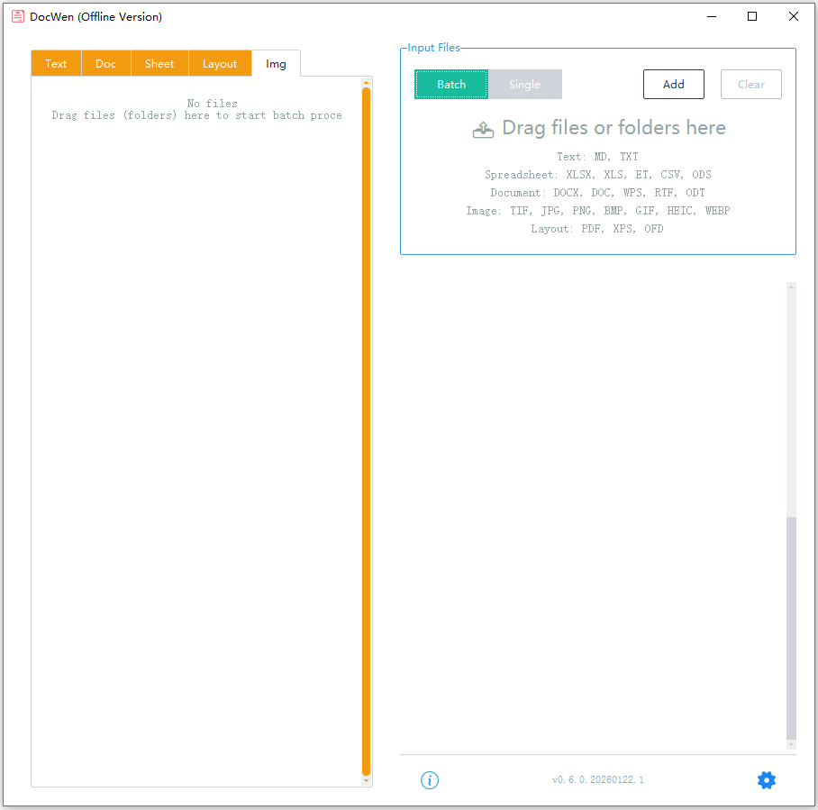
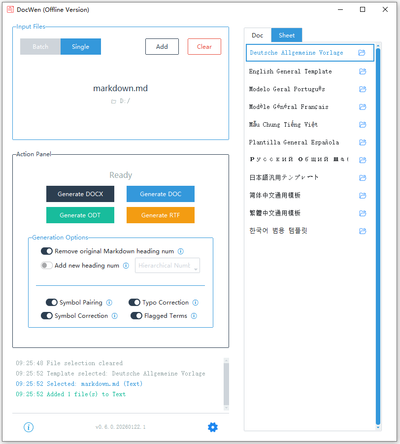
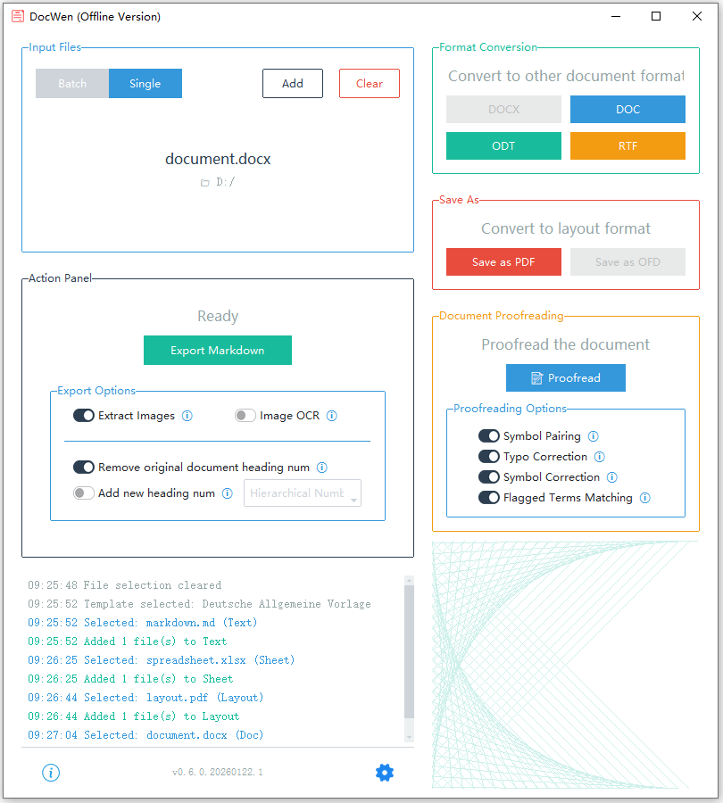
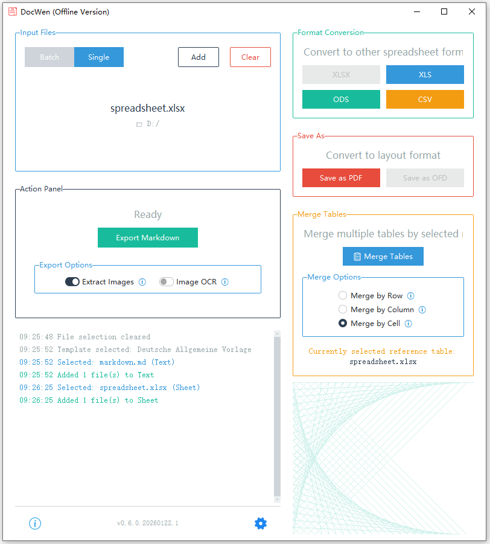
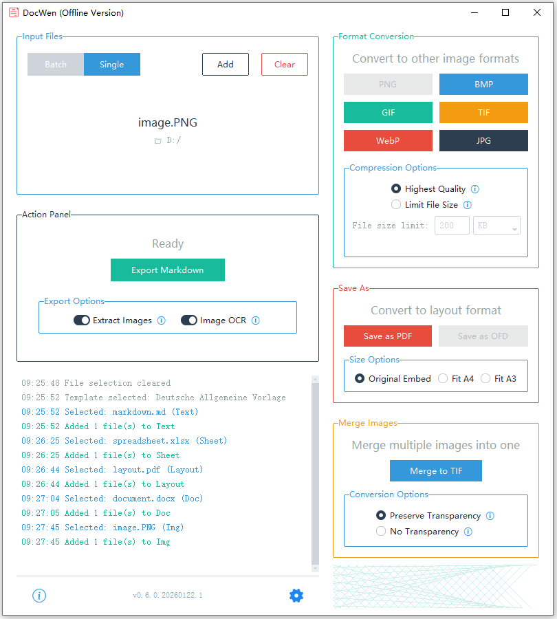
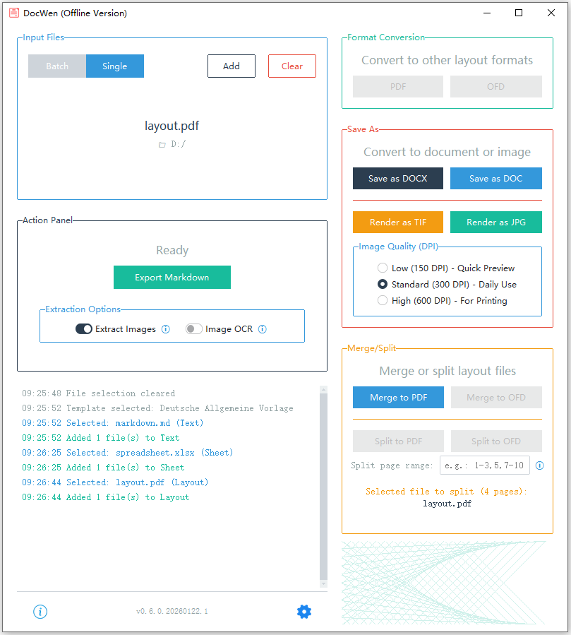

[English](README.md) | [简体中文](README_zh-CN.md) | [繁體中文](README_zh-TW.md) | [Deutsch](README_de-DE.md) | [Français](README_fr-FR.md) | [Русский](README_ru-RU.md) | [Português](README_pt-BR.md) | [日本語](README_ja-JP.md) | [한국어](README_ko-KR.md) | [Español](README_es-ES.md) | [Tiếng Việt](README_vi-VN.md)

# DocWen

Word/Markdown/Excelの双方向変換をサポートするドキュメントおよびチャート形式変換ツール。完全にローカルで実行され、データのセキュリティと信頼性を保証します。

## 📖 プロジェクトの背景

このソフトウェアは、印刷オフィスの日常業務のために、以下の問題を解決するために設計されました：
- さまざまな部門から送信されるドキュメント形式が混沌としており、標準化された形式に整理する必要がある。
- ドキュメントの種類が多く、それぞれに異なる固定フォーマット要件がある。
- イントラネット環境やレガシー機器に適応し、オフラインで実行する必要がある。

**設計哲学**：このソフトウェアは、軽量で誰でも使えるツールとして位置付けられています。プロフェッショナリズムと機能の完全性の点ではLaTeXやPandocのようなプロフェッショナルツールと比較することはできませんが、学習コストがゼロで、すぐに使える使いやすさに優れており、フォーマット要件がそれほど厳しくない日常のオフィスシナリオに適しています。

## ✨ 主な機能

- **📄 ドキュメント形式変換** - Word ↔ Markdownの双方向変換。数式変換、双方向セパレーター変換（Markdownの3種類のセパレーターとWordの改ページ、セクション区切り、水平線）をサポートします。DOCX/DOC/WPS/RTF/ODTなどの形式をサポートします。
- **📊 スプレッドシート形式変換** - Excel ↔ Markdownの双方向変換。XLSX/XLS/ET/ODS/CSV形式をサポートします。テーブル要約ツールが含まれています。
- **📑 PDFおよびレイアウトファイル** - PDF/XPS/OFDからMarkdownまたはDOCXへの変換。PDFの結合、分割、その他の操作をサポートします。
- **🖼️ 画像処理** - JPEG/PNG/GIF/BMP/TIFF/WebP/HEIC形式の双方向変換と圧縮をサポートします。
- **🔍 OCRテキスト認識** - 画像やPDFからテキストを抽出するためにRapidOCRを統合しました。
- **✏️ テキスト校正** - カスタム辞書に基づいて、誤字、句読点、記号、機密用語をチェックします。ルールは設定インターフェースで編集できます。
- **📝 テンプレートシステム** - カスタム文書およびレポート形式をサポートする柔軟なテンプレートメカニズム。
- **💻 デュアルモード操作** - グラフィカルユーザーインターフェース（GUI）+ コマンドラインインターフェース（CLI）。
- **🔒 完全にローカルな操作** - オフラインで実行され、組み込みのネットワーク分離メカニズムによりデータのセキュリティを確保します。
- **🔗 シングルインスタンス操作** - プログラムインスタンスを自動的に管理し、付属のObsidianプラグインとの統合をサポートします。

## 📸 スクリーンショット

| 一括 | Markdown |
| --- | --- |
|  |  |

| ドキュメント | スプレッドシート |
| --- | --- |
|  |  |

| 画像 | レイアウトファイル |
| --- | --- |
|  |  |

更新履歴： [doc/CHANGELOG.md](doc/CHANGELOG.md) を参照

## 🚀 クイックスタート

### プログラムの起動

Windows パッケージ版では `DocWen.exe` をダブルクリックして GUI を起動します。ソース / pip インストールの場合は `docwen-gui` を実行します。

### クイックスタートガイド

1.  **Markdownファイルを準備する**：

    ```markdown
    ---
    title: テストドキュメント
    ---
    
    ## テストタイトル
    
    これはテスト本文の内容です。
    ```

2.  **ドラッグアンドドロップ変換**：
    - プログラムを起動します。
    - `.md` ファイルをウィンドウにドラッグします。
    - テンプレートを選択します。
    - 「DOCXに変換」をクリックします。

3.  **結果を取得**：
    - 標準化されたWordドキュメントが同じディレクトリに生成されます。

**ヒント**：`samples/` ディレクトリのサンプルファイルを使用して、ソフトウェアの機能をすぐに試すことができます。

## 📝 Markdown構文規則

### 見出しレベルのマッピング

背景知識のない同僚が覚えやすくするために、このソフトウェアのMarkdown見出しはWordの見出しと **1対1** で対応しています：
- ドキュメントのタイトルとサブタイトルはYAMLメタデータに配置されます。
- Markdown `# 見出し 1` はWordの「見出し 1」に対応します。
- Markdown `## 見出し 2` はWordの「見出し 2」に対応します。
- 以下同様に、最大9レベルの見出しをサポートします。

**ヒント**：Markdownの一級見出し（`#`）をドキュメントのタイトルとして使用し、二級見出し（`##`）から本文の見出しを始めたい場合は、Wordテンプレートで「見出し1」のスタイルをドキュメントのタイトルのような外観に調整し（例：中央揃え、太字、大きなフォントサイズ）、設定で一級見出しの番号付けをスキップする番号方式を選択してください。これにより、一級見出しがドキュメントのタイトルとして表示されます。

### 改行と段落

**基本ルール**：空でない行はデフォルトで別々の段落として扱われます。

**混合段落**：小見出しを本文と同じ段落に混在させる必要がある場合、以下の条件を満たす必要があります：
1.  小見出しが終了句読点で終わる（多言語の句読点をサポート、ピリオド、疑問符、感嘆符、その他一般的な終了句読点を含む）。
2.  本文が小見出しの **直後の行** にある。
3.  本文の行が特殊なMarkdown要素ではない（見出し、コードブロック、テーブル、リスト、引用、数式ブロック、セパレーターなど）。

**例**：
```markdown
## 一、作業要件。
この会議では、すべてのユニットが真剣に実装する必要があります...
```
上記の2行は同じ段落にマージされ、「一、作業要件。」は小見出し形式を維持し、「この会議では...」は本文形式を維持します。

**注**：
- 小見出しと本文の間に空行を入れることはできません。そうしないと、別々の段落として認識されます。
- 小見出しが句読点で終わらず、本文との間に空行がない場合、本文は書式を調整して見出し行にマージされます。

### 双方向セパレーター変換

MarkdownセパレーターとWordの改ページ/セクション区切り/水平線の間の双方向変換をサポートします：

-   **DOCX → MD**：Wordの改ページ、セクション区切り、水平線は自動的にMarkdownセパレーターに変換されます。
-   **MD → DOCX**：Markdown `---`, `***`, `___` は自動的に対応するWord要素に変換されます。
-   **構成可能**：特定のマッピング関係は設定インターフェースでカスタマイズできます。

### 画像埋め込みとサイズ

Obsidian/Wiki 形式と標準 Markdown の画像埋め込みをサポートし、サイズ指定（px）も可能です：

```markdown
![[image.png]]
![[image.png|300]]
![[image.png\|300]]


```

- サイズ未指定：元のサイズを使用（ページ/セルの有効幅を上限）
- サイズ指定：拡大を許可（ただし有効幅の上限は適用）
- 画像のみ段落：段落スタイル「Image」（中央揃え、単一行間）を使用

## 📖 詳細な使用ガイド

### WordからMarkdownへ

1.  `.docx` ファイルをプログラムウィンドウにドラッグします。
2.  プログラムは自動的にドキュメント構造を分析します。
3.  YAMLメタデータを含む `.md` ファイルを生成します。

**サポートされている形式**：
-   `.docx` - 標準Wordドキュメント。
-   `.doc` - 処理のために自動的にDOCXに変換されます。
-   `.wps` - WPSドキュメントは自動的に変換されます。

**エクスポートオプション**：

| オプション | 説明 |
| :--- | :--- |
| **画像を抽出** | チェックすると、ドキュメント内の画像が出力フォルダに抽出され、画像リンクがMDファイルに挿入されます。 |
| **画像OCR** | チェックすると、画像に対してOCRを実行し、画像 `.md` ファイル（認識されたテキストを含む）を作成します。 |
| **小見出し番号をクリア** | チェックすると、小見出しの前の番号（例：「一、」、「（一）」、「1.」など）を削除し、純粋なタイトルテキストに変換します。 |
| **小見出し番号を追加** | チェックすると、見出しレベルに基づいて自動的に番号を追加します（番号付けスキームは設定で構成可能）。 |

### MarkdownからWordへ

1.  YAMLヘッダー付きの `.md` ファイルを準備します。
2.  プログラムウィンドウにドラッグし、対応するWordテンプレートを選択します。
3.  プログラムは自動的にテンプレートに入力し、ドキュメントを生成します。

**変換オプション**：

| オプション | 説明 |
| :--- | :--- |
| **小見出し番号をクリア** | チェックすると、小見出しの前の番号を削除します。 |
| **小見出し番号を追加** | チェックすると、見出しレベルに基づいて自動的に番号を追加します。 |

**注**：文書で小見出しと本文が混在している段落がある場合、MDファイルで厳密な改行を維持する必要があります（上記の「改行と段落」を参照）。

### 自動テンプレートスタイル処理

コンバーターは、Markdown → DOCX変換中にテンプレートスタイルを自動的に検出して処理します：

#### スタイル分類

**段落スタイル**：段落全体に適用されます。

| スタイル | 検出動作 | 不足時の注入 | ソース |
| :--- | :--- | :--- | :--- |
| 見出し (1~9) | 段落スタイルを検出 | テンプレート見出しスタイル | Word組み込み |
| コードブロック | 段落スタイルを検出 | Consolasフォント + 灰色背景 | ソフトウェア定義 |
| 引用 (1~9) | 段落スタイルを検出 | 灰色背景 + 左境界線 | ソフトウェア定義 |
| 数式ブロック | 段落スタイルを検出 | 数式固有のスタイル | ソフトウェア定義 |
| セパレーター (1~3) | 段落スタイルを検出 | 下境界線段落スタイル | ソフトウェア定義 |

**文字スタイル**：選択したテキストに適用されます。

| スタイル | 検出動作 | 不足時の注入 | ソース |
| :--- | :--- | :--- | :--- |
| インラインコード | 文字スタイルを検出 | Consolasフォント + 灰色網掛け | ソフトウェア定義 |
| インライン数式 | 文字スタイルを検出 | 数式固有のスタイル | ソフトウェア定義 |

**テーブルスタイル**：テーブル全体に適用されます。

| スタイル | 検出動作 | 不足時の注入 | ソース |
| :--- | :--- | :--- | :--- |
| 三線表 | ユーザー設定優先 | 三線表スタイル定義 | ソフトウェア定義 |
| グリッド表 | ユーザー設定優先 | グリッド表スタイル定義 | ソフトウェア定義 |

**番号付け定義**：リスト形式に使用されます。

| タイプ | 検出動作 | 不足時の処理 |
| :--- | :--- | :--- |
| リスト番号付け | テンプレート内の既存の順序付き/順序なしリスト定義をスキャン | 10進数/箇条書きプリセットを使用 |

#### スタイル名の国際化

-   **Word組み込みスタイル**（見出し 1~9）：
    -   スタイル名はWord標準の英語名（例：`heading 1`）を使用します。
    -   Wordはシステム言語に基づいてローカライズされた名前を自動的に表示します（例：日本語システムでは「見出し 1」）。
-   **ソフトウェア定義スタイル**（コードブロック、引用、数式、セパレーター、テーブルなど）：
    -   ソフトウェアのインターフェース言語設定に基づいて、対応する言語スタイル名を注入します。
    -   中国語インターフェース：「代码块」、「引用 1」、「三线表」などを注入。
    -   英語インターフェース：「Code Block」、「Quote 1」、「Three Line Table」などを注入。

**提案**：テンプレートでスタイルをカスタマイズした後、コンバーターは自動的にあなたのスタイルを使用します。テンプレートに存在しない場合は、組み込みのプリセットスタイルを使用します。

### スプレッドシートファイル処理

1.  **Excel/CSVからMarkdownへ**：`.xlsx` または `.csv` ファイルをドラッグして、自動的にMarkdownテーブルに変換します。
2.  **MarkdownからExcelへ**：MDファイルを準備し、変換用のExcelテンプレートを選択します。

**サポートされている形式**：
-   `.xlsx` - 標準Excelドキュメント。
-   `.xls` - 処理のために自動的にXLSXに変換されます。
-   `.et` - WPSスプレッドシートは自動的に変換されます。
-   `.csv` - CSVテキストテーブル。

### テキスト校正機能

プログラムは4つのカスタマイズ可能な校正ルールを提供します：

1.  **句読点ペアリングチェック** - 括弧や引用符などのペアの句読点が一致するかどうかを検出します。
2.  **記号校正** - 中国語と英語の句読点の混在を検出します。
3.  **誤字チェック** - カスタム辞書に基づいて一般的な誤字をチェックします。
4.  **機密用語検出** - カスタム辞書に基づいて機密用語を検出します。

**カスタム辞書**：「設定」インターフェースで誤字と機密用語の辞書を視覚的に編集します。

**使用法**：
1.  校正するWordドキュメントをプログラムにドラッグします。
2.  必要な校正ルールをチェックします。
3.  「テキスト校正」ボタンをクリックします。
4.  校正結果はドキュメント内にコメントとして表示されます。

## 🛠️ テンプレートシステム

### 既存のテンプレートの使用

プログラムには、多言語バージョンを含むさまざまなテンプレートが付属しています。必要に応じて選択して使用できます。テンプレートファイルは `templates/` ディレクトリにあります。

### カスタムテンプレート

1.  WordまたはWPSを使用してテンプレートファイルを作成します。
2.  既存のテンプレートを参照し、記入が必要な場所に `{{Title}}` などのプレースホルダーを挿入します。
3.  テンプレートでは、組み込みの見出し1〜見出し5スタイルを手動で変更する必要があります。
4.  テンプレートを `templates/` ディレクトリに保存します。
5.  プログラムを再起動すると、新しいテンプレートが自動的に読み込まれます。

既存のテンプレートをコピーして変更し、名前を変更することもできます。

### プレースホルダーの使用

#### Wordテンプレートプレースホルダー

**YAMLフィールドプレースホルダー**：テンプレートで `{{フィールド名}}` 形式を使用します。これは、変換中にMarkdownファイルのYAMLヘッダーの対応する値に置き換えられます。

| プレースホルダー | 説明 |
| :--- | :--- |
| `{{Title}}` | ドキュメントタイトル（取得ルール、下記参照） |
| `{{Body}}` | Markdown本文コンテンツ挿入位置 |
| その他 | 任意のカスタムフィールドをサポート |

**タイトル取得優先順位**：

| 優先順位 | ソース | 説明 |
| :--- | :--- | :--- |
| 1 | YAML `Title` フィールド | 最高優先順位 |
| 2 | YAML `aliases` フィールド | リストの最初の要素、または文字列値を取得 |
| 3 | ファイル名 | 拡張子 `.md` なしのファイル名 |

**多言語サポート**：タイトルと本文のプレースホルダーは多言語に対応しています。例：タイトルは `{{title}}`、`{{标题}}`、`{{Titel}}` 等、本文は `{{body}}`、`{{正文}}`、`{{Inhalt}}` 等が使用可能です。

#### Excelテンプレートプレースホルダー

Excelテンプレートは3種類のプレースホルダーをサポートします：

**1. YAMLフィールドプレースホルダー** `{{フィールド名}}`

MarkdownファイルのYAMLヘッダーから単一の値を入力するために使用されます：

```markdown
---
ReportName: 2024年年間売上統計
Unit: 営業部
---
```

テンプレート内の `{{ReportName}}`, `{{Unit}}` は対応する値に置き換えられます。タイトルフィールドも優先順位に従って取得されます。

**2. 列埋め込みプレースホルダー** `{{↓フィールド名}}`

Markdownテーブルからデータを抽出し、プレースホルダー位置から行ごとに **下方向** に入力します：

```markdown
| ProductName | Quantity |
|:--- |:--- |
| 製品A | 100 |
| 製品B | 200 |
```

Excelテンプレート内の `{{↓ProductName}}` は「製品A」に置き換えられ、次の行は「製品B」で埋められます。

**3. 行埋め込みプレースホルダー** `{{→フィールド名}}`

Markdownテーブルからデータを抽出し、プレースホルダー位置から列ごとに **右方向** に入力します：

```markdown
| Month |
|:--- |
| 1月 |
| 2月 |
| 3月 |
```

Excelテンプレート内の `{{→Month}}` は、右方向に「1月」、「2月」、「3月」と順に入力されます。

**結合セルの処理**：プログラムは、正しいデータ入力を確保するために、結合セルの非プライマリセルを自動的にスキップします。

**複数テーブルデータのマージ**：Markdownに同じヘッダー名を使用する複数のテーブルがある場合、データは順番にマージされ、順次入力されます。

## 🖥️ グラフィカルインターフェースの使用

ほとんどのユーザーは、グラフィカルインターフェースを介してこのソフトウェアを使用します。詳細な操作ガイドは次のとおりです。

### インターフェースの概要

プログラムは **適応型3列レイアウト** を使用します：

| エリア | 説明 | 表示タイミング |
| :--- | :--- | :--- |
| **中央列（メインエリア）** | ファイルドラッグアンドドロップエリア、操作パネル、ステータスバー | 常に表示 |
| **右列** | テンプレートセレクター / 形式変換パネル | ファイル選択後に自動的に展開 |
| **左列** | バッチファイルリスト（タイプ別にグループ化） | バッチモード切り替え時に表示 |

### 基本操作フロー

1.  **プログラムの起動**：`DocWen.exe`（Windows パッケージ版）をダブルクリックするか、`docwen-gui` を実行します。
2.  **ファイルのインポート**：
    -   方法1：ファイルをウィンドウに直接ドラッグアンドドロップします。
    -   方法2：ドラッグアンドドロップエリアの「追加」ボタンをクリックしてファイルを選択します。
3.  **テンプレートの選択**（変換が必要な場合）：右側のテンプレートパネルが自動的に展開します。適切なテンプレートを選択します。
4.  **オプションの構成**：操作パネルで必要な変換/エクスポートオプションをチェックします。
5.  **操作の実行**：対応する機能ボタン（例：「MDエクスポート」、「DOCXに変換」など）をクリックします。
6.  **結果の表示**：ステータスバーに進捗状況と結果が表示されます。📍アイコンをクリックして出力ファイルを見つけます。

### 単一ファイルモード vs. バッチモード

プログラムは2つの処理モードをサポートしており、ファイルドラッグアンドドロップエリアのトグルボタンで切り替えることができます：

**単一ファイルモード**（デフォルト）：
-   一度に1つのファイルを処理します。
-   シンプルなインターフェース、日常使用に適しています。

**バッチモード**：
-   複数のファイルを同時にインポートします。
-   左列に分類されたファイルリストが表示されます（ドキュメント/スプレッドシート/画像などでグループ化）。
-   バッチ追加、削除、並べ替えをサポートします。
-   リスト内のファイルをクリックすると、現在の操作対象が切り替わります。

### 操作パネル機能

操作パネルは、ファイルの種類に基づいて利用可能なオプションを自動的に調整します：

| ファイルタイプ | 利用可能な操作 |
| :--- | :--- |
| Wordドキュメント | MDエクスポート、PDF変換、テキスト校正、OCR |
| Markdown | DOCX変換、PDF変換 |
| Excelスプレッドシート | MDエクスポート、PDF変換、テーブル要約 |
| PDFファイル | MDエクスポート、結合、分割、OCR |
| 画像ファイル | 形式変換、圧縮、OCR |

### 設定インターフェース

ウィンドウの右下隅にある ⚙️ ボタンをクリックして設定を開きます：

-   **一般**：インターフェーステーマ、言語、ウィンドウの不透明度。
-   **変換**：さまざまな変換オプションのデフォルト値。
-   **出力**：デフォルトの出力ディレクトリ、ファイル命名規則。
-   **校正**：誤字および機密用語の辞書を編集します。
-   **スタイル**：コードブロック、引用、テーブルスタイル構成。

### ショートカット

-   **外部ファイルのドラッグ**：ウィンドウに直接ドラッグしてインポートします。
-   **ステータスバー結果のダブルクリック**：出力ファイルディレクトリをすばやく開きます。
-   **テンプレート項目の右クリック**：テンプレートファイルの場所を開きます。

---

## 🔧 コマンドラインの使用

GUIに加えて、プログラムは自動化スクリプトやバッチ処理シナリオに適したコマンドラインインターフェース（CLI）を提供します。

### 実行モード

-   **CLIモード**：サブコマンド（例：`convert`、`validate`）を使用して実行します。自動化スクリプトやバッチ処理に適しています。

### 一般的な例

```bash
# パッケージ版（Windows）
DocWenCLI.exe convert document.docx --to md

# WordをMarkdownにエクスポート（画像抽出 + OCR）
DocWenCLI.exe convert report.docx --to md --extract-img --ocr

# MarkdownをWordに変換（テンプレート指定）
DocWenCLI.exe convert document.md --to docx --template "テンプレート名"

# バッチ変換（確認をスキップ、エラー時に続行）
DocWenCLI.exe convert *.docx --to md --batch --yes --continue-on-error

# ドキュメント校正
DocWenCLI.exe validate document.docx --check typo --check punct

# PDF結合/分割
DocWenCLI.exe merge-pdfs *.pdf
DocWenCLI.exe split-pdf report.pdf --pages "1-3,5,7-10"

# ソース / pip インストール
docwen convert document.docx --to md
docwen convert report.docx --to md --extract-img --ocr
```

### 主なコマンドとオプション

| コマンド / オプション | 説明 |
| :--- | :--- |
| `convert <files...> --to <fmt>` | 目標形式へ変換（`md` を含む） |
| `validate <files...> --check ...` | 文書校正（`--check typo/punct/symbol/sensitive/all/none`） |
| `merge-pdfs <files...>` | PDF/OFD/XPS を結合 |
| `split-pdf <file> --pages ...` | ページ範囲で PDF を分割 |
| `merge-tables <files...> --mode row|col|cell` | 表の結合 |
| `merge-images-to-tiff <files...>` | 画像を TIFF に結合 |
| `md-numbering <files...>` | Markdown 見出し番号の処理 |
| `templates list [--for docx|xlsx]` | 利用可能なテンプレートを一覧表示 |
| `optimizations list [--scope ...]` | 利用可能な最適化タイプを一覧表示 |
| `formats list [--for-source document|spreadsheet|layout|image|markdown]` | 利用可能なターゲット形式を一覧表示 |
| `inspect <file>` | ファイル種別/形式と対応操作を表示 |
| `--template <name>` | テンプレート名（`convert` で使用） |
| `--extract-img` / `--no-extract-img` / `--ocr` | `convert --to md` の画像/OCR オプション |
| `--optimize-for <id>` | 最適化を明示的に有効化（例：`gongwen`, `invoice_cn`） |
| `--batch` / `--jobs` / `--continue-on-error` | バッチ処理制御 |
| `--json` | 結果を JSON 形式で出力 |
| `--quiet` / `-q` | 静音モード、出力を減らす |
| `--lang` | 言語を切り替え（help/メッセージに反映） |

## 🔌 Obsidianプラグイン

プロジェクトには、コンバーターと連携して使用するための対応するObsidianプラグインが含まれています：

### 主な機能

-   **🚀 ワンクリック起動** - サイドバーアイコンでコンバーターをすばやく起動。
-   **📂 自動ハンドオーバー** - 現在開いているファイルパスを自動的に渡します。
-   **🔄 シングルインスタンス管理** - プログラムがすでに実行されている場合、再起動せずにファイルを自動的に送信します。
-   **💪 クラッシュ回復** - プロセスステータスを自動的に検出し、残留ファイルを自動的にクリーンアップします。

### 動作原理

プラグインは、ファイルシステムベースのIPCを介してコンバーターと対話します：

1.  **最初のクリック** → コンバーターを起動し、現在のファイルを渡します。
2.  **再クリック（ファイルあり）** → 新しいファイルに置き換えます（単一ファイルモード）。
3.  **再クリック（ファイルなし）** → コンバーターウィンドウをアクティブにします。

### インストール

プラグインは独立したリポジトリで公開されています。インストール手順と最新バージョンについては、[docwen-obsidian](https://github.com/ZHYX91/docwen-obsidian) をご覧ください。

## ❓ FAQ

### 変換に失敗した場合は？

-   ファイルが別のプログラムによって使用されていないか確認してください。
-   ファイル形式が正しいことを確認してください。
-   `logs/` ディレクトリのエラーログを確認してください。

### テンプレートが表示されない？

-   テンプレートファイルが `templates/` ディレクトリにあることを確認してください。
-   テンプレートファイルが破損していないか確認してください。
-   プログラムを再起動してテンプレートをリロードしてください。

### 校正機能が機能しない？

-   ドキュメントが .docx 形式であることを確認してください。
-   ドキュメントに編集可能なテキストが含まれているか確認してください。
-   設定で校正ルールが有効になっていることを確認してください。

### 出力形式が期待通りでない？

-   プログラムはテンプレートスタイルに基づいてドキュメントを生成します。出力形式を調整するには、テンプレートファイルのスタイル定義を直接変更してください。
-   テンプレートファイルは `templates/` ディレクトリにあります。
-   テンプレートスタイルを変更すると、そのテンプレートを使用して変換されたすべてのドキュメントに新しいスタイルが適用されます。

### Excel から Markdown への変換後、数式セルが空になる？

これは予想される動作です。プログラムは数式自体ではなく、セルの**キャッシュ値**を読み取ります。

**技術的な理由**：
-   Excel ファイルでは、数式セルは数式と最後に計算された結果（キャッシュ値）の両方を保存します。
-   プログラムは `data_only=True` モードを使用し、キャッシュ値のみを取得します。
-   ファイルが Excel で一度も開かれたことがない場合（例：プログラムで生成された場合）、または編集後に再保存されていない場合、キャッシュ値は空になります。

**解決方法**：
1.  Excel でファイルを開きます。
2.  数式の計算が完了するまで待ちます。
3.  ファイルを保存します。
4.  再度変換します。

## 🔒 セキュリティ機能

-   **完全にローカルな操作**：すべての処理はローカルで行われ、ネットワークに依存しません。
-   **ネットワーク分離**：組み込みのネットワーク分離メカニズムにより、データ漏洩を防ぎます。
-   **データアップロードなし**：ユーザーファイルがいかなるサーバーにもアップロードされることはありません。
-   **厳格セキュリティモード**：デフォルトで有効。セキュリティチェックに失敗すると終了します。詳細は [doc/技术文档.md](doc/技术文档.md)。

## 📜 ライセンス

このプロジェクトは **GNU Affero General Public License v3.0 (AGPL-3.0)** の下でライセンスされています。

[](https://www.gnu.org/licenses/agpl-3.0)

-   このプロジェクトはPyMuPDF（AGPL-3.0ライセンス）を使用しているため、プロジェクト全体もAGPL-3.0の下でライセンスされます。
-   このソフトウェアを自由に使用、変更、配布できます。
-   このソフトウェアを変更してネットワーク経由でサービスを提供する場合、変更されたソースコードをユーザーに提供する必要があります。
-   詳細なライセンス情報については、[LICENSE](LICENSE) ファイルを参照してください。

### 連絡先

-   **GitHub**: https://github.com/ZHYX91/docwen
-   **連絡先著者**: zhengyx91@hotmail.com

---

**著者**: ZhengYX
