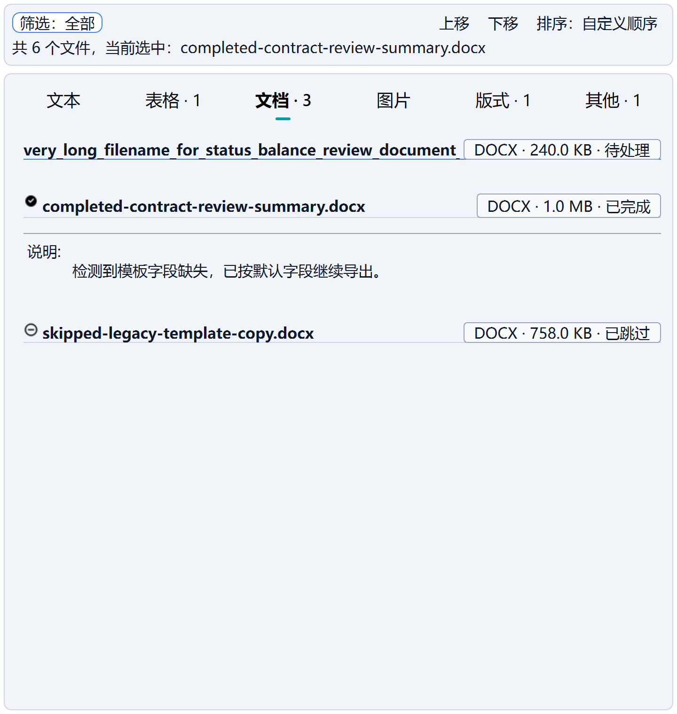
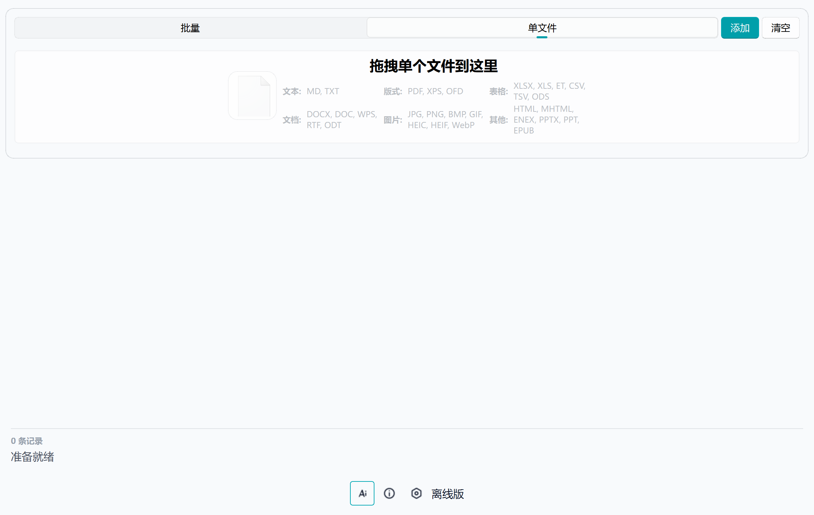
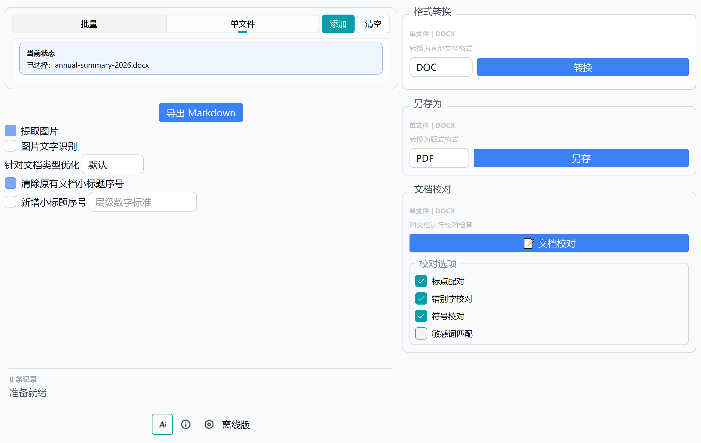
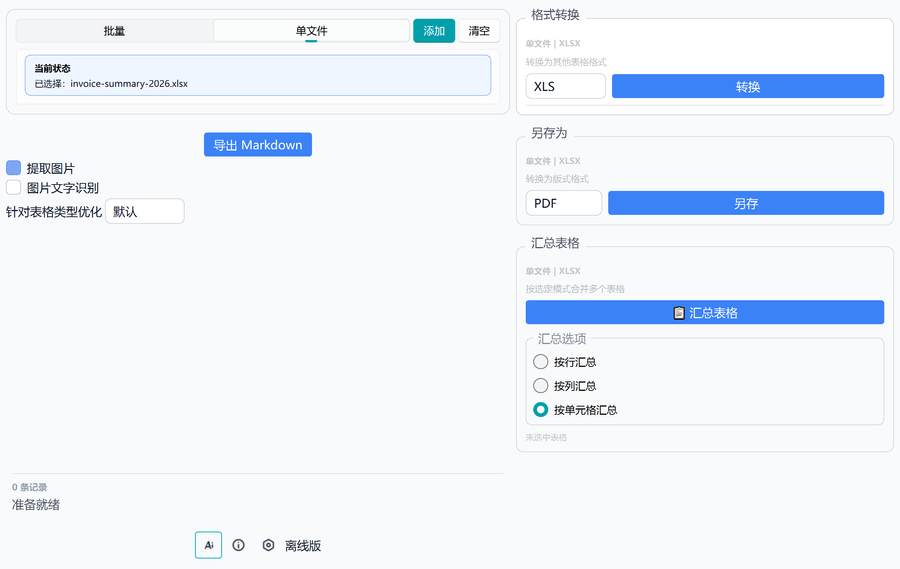
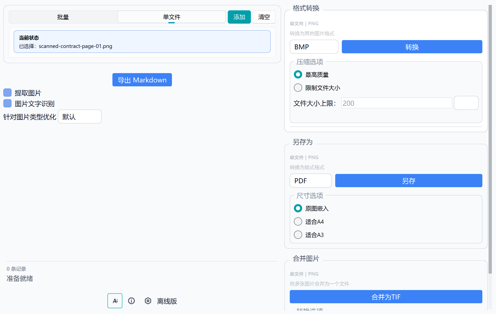
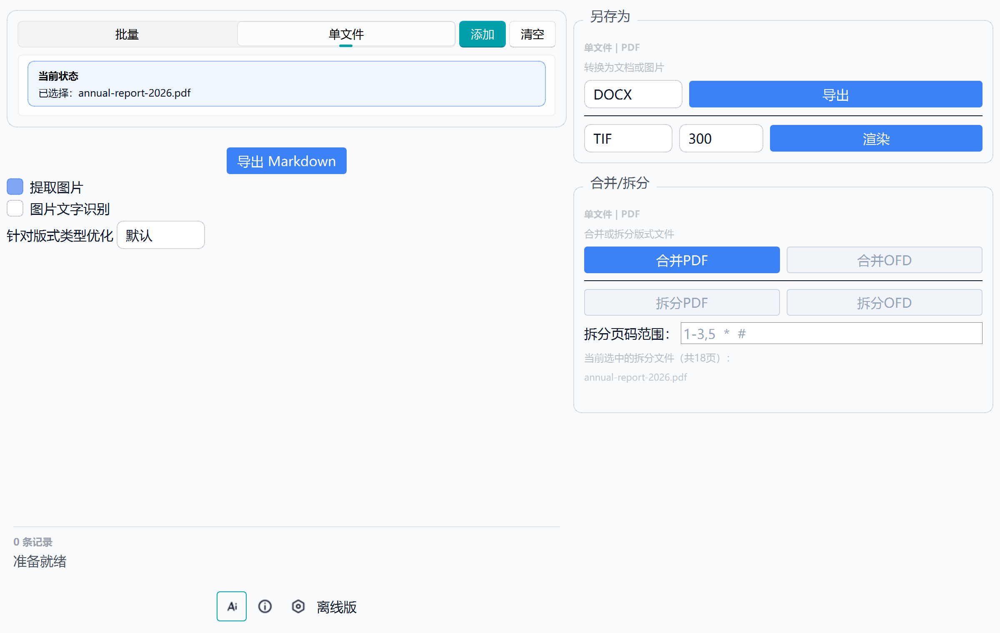

# DocWen

<p align="center">
  
</p>

[English](https://github.com/ZHYX91/docwen/blob/main/README.md) · [简体中文](https://github.com/ZHYX91/docwen/blob/main/docs/user-guides/README.zh-CN.md) · [繁體中文](https://github.com/ZHYX91/docwen/blob/main/docs/user-guides/README.zh-TW.md) · [Deutsch](https://github.com/ZHYX91/docwen/blob/main/docs/user-guides/README.de-DE.md) · [Français](https://github.com/ZHYX91/docwen/blob/main/docs/user-guides/README.fr-FR.md) · [Español](https://github.com/ZHYX91/docwen/blob/main/docs/user-guides/README.es-ES.md) · [Português](https://github.com/ZHYX91/docwen/blob/main/docs/user-guides/README.pt-BR.md) · [Русский](https://github.com/ZHYX91/docwen/blob/main/docs/user-guides/README.ru-RU.md) · [日本語](https://github.com/ZHYX91/docwen/blob/main/docs/user-guides/README.ja-JP.md) · [한국어](https://github.com/ZHYX91/docwen/blob/main/docs/user-guides/README.ko-KR.md) · [Tiếng Việt](https://github.com/ZHYX91/docwen/blob/main/docs/user-guides/README.vi-VN.md)

DocWen - 支持 Word/Markdown/Excel 互转，完全本地运行，数据安全可靠。

## 📖 项目背景

本软件最初为文印室日常工作设计，解决以下问题：

- 各科室发来的文档格式混乱，需要整理为规范格式
- 文档类型繁多，每种类型有不同的固定格式要求
- 需要离线运行，并适配内网环境和老旧设备

**设计理念**：本软件定位为轻量级傻瓜式工具，在专业性和功能完整性上无法与 LaTeX、Pandoc 等专业工具相比，但胜在零学习成本、开箱即用，适合对格式要求不高的日常办公场景。

## ✨ 核心功能

- **📄 文档格式转换** - Word ↔ Markdown 互转，支持数学公式转换、分隔符双向转换（Markdown的三种分隔线与文档中的分页符、分节符、分隔线），以及 Markdown 表格显式 `<` / `^` marker 到 Word 矩形合并的恢复。支持 DOCX/DOC/WPS/RTF/ODT 等格式。
- **📊 表格格式转换** - Excel ↔ Markdown 互转，支持 XLSX/XLS/ET/ODS/CSV/TSV 等格式；支持合并单元格导出策略（`fill / empty / marker`）、模板字段和表格汇总工具。
- **📑 PDF与版式文件** - PDF/XPS/OFD 转 Markdown 或 DOCX，支持 PDF 合并、拆分等操作。
- **🖼️ 图片处理** - 支持 JPEG/PNG/GIF/BMP/TIFF/WebP/HEIC 等格式互转和压缩。
- **📥 其他格式导入** - 支持 HTML/MHTML/ENEX/EPUB/PPTX/PPT 单向转换为 Markdown。
- **🔍 OCR文字识别** - 集成 RapidOCR，从图片和 PDF 中提取文字。
- **✏️ 文本校对** - 基于自定义词库检查错别字、标点、符号和敏感词。支持 Word (.docx) 和 Markdown (.md) 文件。可在设置界面编辑规则。
- **📝 模板系统** - 灵活的模板机制，支持自定义文档和报表格式。
- **💻 双模式操作** - 图形界面 + 命令行界面。
- **🔒 本地处理与依赖出站保护** - 转换不依赖在线服务。DocWen 运行期间会阻止其 Python 进程内依赖使用 DNS 和 IPv4/IPv6；外部启动的 Office/WPS/LibreOffice 仍遵循自身及系统网络策略。
- **🔗 单实例运行** - 自动管理程序实例，支持与配套 Obsidian 插件集成。

## 📸 界面截图

| 批处理                                    | Markdown                                        |
| -------------------------------------- | ----------------------------------------------- |
|  |  |

| 文档                                       | 表格                                          |
| ---------------------------------------- | ------------------------------------------- |
|  |  |

| 图片                                    | 版式文件                                     |
| ------------------------------------- | ---------------------------------------- |
|  |  |

更新日志：见 [CHANGELOG.md](../CHANGELOG.md)

## 🚀 快速开始

### 从源码安装

**前置条件**：Python 3.12

**0.9 目标边界**：当前源码构建 Windows x64 和 Ubuntu 24.04 x64 正式包。其他 Linux
发行版与 macOS 仍属于源码/开发路径，不在 Ubuntu 包的支持承诺内。

**方式一：使用 uv（推荐）**

安装 [uv](https://docs.astral.sh/uv/getting-started/)，然后：

```bash
git clone https://github.com/ZHYX91/docwen.git
cd docwen
uv sync --frozen --all-extras
```

DocWen 0.9 源码、测试与构建仅支持仓库内锁文件及 `uv 0.12.0`；不支持 `pip install -e`。

### 启动程序

Windows 打包版可双击 `DocWen.exe` 启动图形界面。从源码安装后可运行：

```bash
docwen-gui  # 图形界面
docwen      # 命令行
```

### macOS 安装说明

**当前限制**：macOS 上的 `convert`、`validate`、`number`、`merge`、`split` capability 当前均为
unavailable。下面只记录开发实验所需的可选依赖。

**LibreOffice 支持（可选）**

如需转换 `.doc`、`.xls` 等旧格式，请安装 LibreOffice：\
下载地址：<https://www.libreoffice.org/download/>

**HEIC 图片支持（可选）**

如需处理 HEIC/HEIF 格式图片：

```bash
brew install libheif
pip install pillow-heif
```

### Linux GUI 版本前置条件

**支持的打包目标**：DocWen 0.9 支持 Ubuntu 24.04 x64 打包 GUI 与 CLI。以下前置条件
不会把支持承诺扩展到其他发行版或架构。

- 已安装桌面环境（GNOME、KDE、XFCE 等均可）
- GUI 基于 PySide6（Qt6），不再依赖 Python Tk；如启动时报缺少系统库，请按报错提示安装对应的 Qt 运行时依赖（常见为 OpenGL/X11 相关库）
- 纯服务器（无显示环境）建议优先使用 `docwen` CLI 入口而非 GUI；Windows 打包版同时提供 `DocWenCLI.exe`。

### 快速入门指南

1. **准备一个 Markdown 文件**：
   ```markdown
   ---
   标题: 测试文档
   ---

   ## 测试标题

   这是测试正文内容。
   ```
2. **拖拽转换**：
   - 启动程序
   - 将 .md 文件拖入窗口
   - 选择模板
   - 点击"转换为 DOCX"
3. **获取结果**：
   - 在相同目录下生成格式规范的 Word 文档

**提示**：新手可以使用 `samples/` 目录中的示例文件快速体验软件功能。

## 🖥️ 图形界面使用

大部分用户通过图形界面使用本软件，以下是详细的操作指南。

### 界面概览

程序采用**自适应三栏布局**设计：

| 区域          | 说明             | 显示时机       |
| ----------- | -------------- | ---------- |
| **中栏（主区域）** | 文件拖拽区、操作面板、状态栏 | 始终显示       |
| **右栏**      | 模板选择器 / 格式转换面板 | 选择文件后自动展开  |
| **左栏**      | 批量文件列表（按类型分组）  | 切换到批量模式时显示 |

### 基本操作流程

1. **启动程序**：双击 `DocWen.exe`（Windows 打包版）或运行 `docwen-gui`
2. **导入文件**：
   - 方式一：直接拖拽文件到窗口
   - 方式二：点击拖拽区域的"添加"按钮选择文件
3. **选择模板**（如需转换）：右侧模板面板自动展开，选择合适的模板
4. **配置选项**：在操作面板中勾选需要的转换/导出选项
5. **执行操作**：点击对应的功能按钮（如"导出MD"、"转换为DOCX"等）
6. **查看结果**：状态栏显示处理进度和结果，可点击右侧的“打开输出”操作打开输出位置

### 单文件模式与批量模式

程序支持两种处理模式，可通过文件拖拽区域的切换按钮切换：

**单文件模式**（默认）：

- 一次处理一个文件
- 界面简洁，适合日常使用

**批量模式**：

- 可同时导入多个文件
- 左栏显示分类文件列表（按文档/表格/图片等分组）
- 支持批量添加、移除、排序
- 点击列表中的文件可切换当前操作对象

### 操作面板功能

操作面板根据文件类型自动调整可用选项：

| 文件类型            | 可用操作                |
| --------------- | ------------------- |
| Word文档          | 导出MD、转换PDF、文本校对、OCR |
| Markdown        | 转换DOCX、转换PDF、文本校对   |
| Excel表格         | 导出MD、转换PDF、表格汇总     |
| PDF文件           | 导出MD、合并、拆分、OCR      |
| 图片文件            | 格式转换、压缩、OCR         |
| HTML/EPUB/PPTX等 | 导出MD                |

### 设置界面

点击操作区标题行中的“设置”按钮打开设置界面，可配置：

设置按选项卡组织：**通用**、**文本**、**校对**、**文档**、**表格**、**图片**、**版式**、**链接**、**格式**、**输出**、**导出**、**日志**、**其他**。

### 快捷操作

- **拖拽外部文件**：直接拖入窗口即可导入
- **打开输出**：点击状态栏右侧的“打开输出”操作打开输出位置
- **右键模板项**：打开模板文件位置

***

## 🔧 命令行使用

除了图形界面，程序还提供命令行界面（CLI），适合自动化脚本、批量处理和外部集成场景。

### 推荐自动化调用顺序

对于脚本、Agent 或插件集成，建议按下面顺序调用：

1. `inspect <file> [--json]`：先识别文件真实类别、格式与可执行动作。
2. `schema convert`：读取 `convert` 的机器可读参数契约与条件约束。
3. `convert <file> --to <fmt> --output <path> --dry-run --json`：先预演检测、归一化和路由结果，不直接落地转换。
4. `convert <file> --to <fmt> --output <path> ...`：确认后再执行正式转换。

### 常用示例

```bash
# Windows 打包版
DocWenCLI.exe inspect document.docx --json

# 查看 convert 参数契约（适合脚本/Agent 组装请求）
DocWenCLI.exe schema convert

# 预演本次转换会如何执行，但不实际写出结果
DocWenCLI.exe convert report.docx --to md --output report.md --extract-img --ocr --dry-run --json

# 导出 Word 为 Markdown（提取图片 + OCR）
DocWenCLI.exe convert report.docx --to md --output report.md --extract-img --ocr

# Markdown 转 Word（指定模板，并设置标题+正文合并模式）
DocWenCLI.exe convert document.md --to docx --output document.docx --template template.docx.4be17c7a0791c896a542605427f1c3cb6597892292f2f9ddc6df82047d2120bf --heading-merge-mode punct_required

# 控制 Markdown 导出图片与 OCR 文本落位
DocWenCLI.exe convert report.docx --to md --output report.md --extract-img --image-mode file --ocr --ocr-placement image_md

# 查看当前环境下的运行时能力与依赖门控
DocWenCLI.exe doctor --json
DocWenCLI.exe resources list formats --json

# 文档校对
DocWenCLI.exe validate document.docx --check typo --check punct
DocWenCLI.exe validate input.md --check typo --check punct

# 源码 / uv 安装
# inspect -> schema -> dry-run -> convert
# docwen inspect document.docx --json
# docwen schema convert
# docwen convert document.docx --to md --output document.md --dry-run --json
# docwen convert document.docx --to md --output document.md
```

### 常用命令与选项

下表只列出常用命令；完整命令面请以 `docwen --help`（源码 / uv 安装）或 `DocWenCLI --help`（打包版）为准。

| 命令/选项 | 说明 |
| --- | --- |
| `convert <file> --to <fmt> --output <path>` | 统一转换入口。 |
| `convert <file> --to <fmt> --output <path> --dry-run --json` | 仅预演检测、归一化、路由与生效参数，不执行实际转换。 |
| `validate` / `number markdown` / `merge` / `split` | 校对、编号、合并和拆分使用各自的领域命令，不暴露内部 action 名称。 |
| `validate <file> --check ... [--report <path>]` | 默认只读校对；只有显式指定 `--report` 才写出报告文件。 |
| `schema convert` | 导出 `convert` 的机器可读参数契约、默认值、条件约束与规范键。 |
| `inspect <file> [--json]` | 查询文件类别/格式、推荐动作，以及扩展名与内容不一致警告。 |
| `doctor --json` | 输出诊断结果，并附带运行时能力摘要与依赖门控信息。 |
| `resources list formats --json` | 按源类别列出可用目标格式，并附带运行时依赖门控 / 限制摘要。 |
| `resources list templates` | 列出可用模板。 |
| `resources list numbering-schemes` | 列出可用序号方案。 |
| `--template <id>` | 原样使用 `resources list templates` 返回的 canonical 资源 ID；显示名、文件名和路径直接拒绝。DOCX ID 用于 `docx/doc/odt/rtf/wps/pdf`，XLSX ID 用于 `xlsx/xls/ods/csv`。 |
| `--extract-img` / `--no-extract-img` / `--ocr` | `convert --to md` 的图片提取与 OCR 选项。 |
| `--image-mode file|base64` | 控制 Markdown 导出中的图片落地方式。 |
| `--ocr-placement image_md|main_md` | 控制 OCR 文本写入图片配套 Markdown 还是主 Markdown。 |
| `--heading-merge-mode punct_required|always|never` | 控制 `convert --to docx` 时“标题 + 正文”段落合并策略。 |
| `--optimization <id>` | 显式启用某个优化配置（可用列表见 `resources list optimizations`）。 |
| `batch convert|validate ... --jobs <n> [--continue-on-error]` | 批量处理控制。 |
| `--json` / `--quiet` / `--timing` | 结构化输出、压缩日志与耗时信息，适合脚本或插件调用。 |


## 📝 Markdown 语法约定

### 标题级别映射

为方便无背景知识的同事记忆，本软件的Markdown标题与Word标题**一一对应**：

- 文档的标题（title）和副标题（subtitle）放在YAML元数据中
- Markdown的 `# 一级标题` 对应 Word的"标题1"
- Markdown的 `## 二级标题` 对应 Word的"标题2"
- 以此类推，最多支持9级标题

**提示**：如果您习惯用 Markdown 的一级标题（`#`）表示文档标题（title），从二级标题（`##`）开始表示正文小标题（heading），可以在 Word 模板中将"标题1"样式调整为文档标题的外观（如居中、加粗、较大字号），并在设置的序号方案中选择"跳过一级标题编号"的方案。这样，一级标题就能呈现为文档标题的效果。

### 换行与分段

**基本规则**：每个非空行默认作为独立段落处理。

**混合段落**：当小标题需要与正文混合在同一段时（默认“有标点才合并”模式），需满足以下条件：

1. 小标题末尾是设置中允许的触发符号。默认值精确为 `。：！？.:!?`，即全角或半角的句号、冒号、问号、叹号
2. 正文文本位于小标题的**紧邻下一行**
3. 正文行不能是特殊 Markdown 元素（如标题、代码块、表格、列表、引用、公式块、分隔线等）

**示例**：

```markdown
## 一、工作要求。
本次会议要求各单位认真落实...
```

上述两行会被合并为同一段落，其中"一、工作要求。"保持小标题格式，"本次会议..."为正文格式。

**注意**：

- 小标题和正文之间不能有空行，否则会被识别为独立段落
- 默认情况下（有标点才合并模式），如果小标题末尾没有结束标点符号，即使与正文之间无空行，也会被识别为独立段落，不会合并
- 可在设置界面“格式”→“Markdown 转为文档”中调整“标题 + 正文合并模式”和触发符号。触发符号留空时，“有标点才合并”模式不会合并任何段落
- 逗号、分号、顿号、破折号和省略号默认不触发合并；确有需要时可以由用户明确加入

### 分隔线双向转换

支持 Markdown 分隔线与 Word 分页符/分节符/分隔线的双向转换：

- **DOCX → MD**：Word 中的分页符、分节符、分隔线自动转换为 Markdown 分隔线
- **MD → DOCX**：Markdown 中的 `---`、`***`、`___` 自动转换为对应的 Word 元素
- **可配置**：具体映射关系可在设置界面自定义

### 任务列表

支持 GFM 任务列表的双向转换：

```markdown
- [ ] 待办事项
- [x] 已完成
```

- **MD → DOCX**：渲染为无序列表，文本前添加 `☐` / `☑` 前缀
- **DOCX → MD**：识别列表项中的 `☐` / `☑` / `☒` 前缀，还原为 `- [ ]` / `- [x]`
- **字体提示**：`☐`/`☑` 在部分字体下可能无法显示，如有需要请在 Word 模板中使用 "Segoe UI Symbol" 等支持该字符的字体

### 图片嵌入与尺寸

支持 Obsidian/Wiki 与标准 Markdown 图片嵌入，并可指定宽高（单位：px）：

```markdown
![[image.png]]
![[image.png|300]]
![[image.png\|300]]


```

- 未指定尺寸：使用图片原始尺寸，但不超过页面/单元格可用宽度
- 指定尺寸：允许放大，但仍受可用宽度上限限制
- 纯图片段落：自动使用“图片”段落样式（居中、单倍行距）

### 链接处理

支持 Markdown -> DOCX 的可点击链接：

```markdown
[Docwen](https://example.com)
[[Target]]
[[Target|Open target]]
<https://example.com>
<user@example.com>
```

- Markdown 链接和 Wiki 链接默认写入为 Word 超链接
- Wiki 链接在找到目标文件时会解析为本地 `file:///` 链接
- 尖括号自动链接支持 `https://...` 和邮箱 `mailto:...`
- 裸 URL 自动链接按 Markdown -> DOCX 请求独立消费，默认关闭，可通过 `configs/link.toml` 的 `[non_embed_links].auto_link_bare_url` 开启
- Markdown -> XLSX 不生成 DOCX 超链接占位符，会保留原始链接语法

## 📖 详细使用指南

### Word 转 Markdown

1. 将 .docx 文件拖入程序窗口
2. 程序自动分析文档结构
3. 生成包含 YAML 元数据的 .md 文件

**支持的格式**：

- `.docx` - 标准 Word 文档
- `.doc` - 自动转换为 DOCX 后处理
- `.wps` - WPS 文档自动转换

**导出选项说明**：

| 选项           | 说明                                                                      |
| ------------ | ----------------------------------------------------------------------- |
| **提取图片**     | 勾选后，将文档中的图片提取到输出文件夹，MD文件中插入图片链接                                         |
| **图片文字识别**   | 勾选后，对图片进行OCR识别，创建图片.md文件（包含识别的文字）                                       |
| **高级字段优化** | 勾选后，提取更丰富的结构化元数据；不勾选则使用简化模式，YAML只包含标题和副标题两个基本字段 |
| **清理小标题序号**  | 勾选后，移除小标题前的序号（如"一、""（一）""1."等），转换为纯标题文本                                 |
| **添加小标题序号**  | 勾选后，根据标题层级自动添加序号（可在设置中配置序号方案）                                           |

补充：DOCX -> MD 现支持还原通过段落样式（pStyle）关联到 numbering.xml 的多级列表序号，因此 Word/WPS 中用多级列表实现的标题前缀（如“一、”“（一）”“1．”“（1）”“①”）在简化模式和高级字段模式下都能保留；勾选“清理小标题序号”后仍会正确识别标题级别。

### Markdown 转 Word

1. 准备包含 YAML 头部的 .md 文件
2. 拖入程序窗口并选择对应的 Word 模板
3. 程序自动填充模板并生成文档

**转换选项说明**：

| 选项          | 说明                                      |
| ----------- | --------------------------------------- |
| **清理小标题序号** | 勾选后，移除小标题前的序号（如"一、""（一）""1."等），转换为纯标题文本 |
| **添加小标题序号** | 勾选后，根据标题层级自动添加序号（可在设置中配置序号方案）           |

**注意**：如果存在小标题和正文文本混合的段落，在MD文件中需要保持严格换行（参见上方"换行与分段"说明）。

### 模板样式自动处理

转换器在 Markdown → DOCX 转换时会自动检测和处理模板样式：

#### 样式分类

**段落样式（Paragraph Style）**：应用到整个段落

| 样式                | 检测行为   | 缺失时注入              | 来源      |
| ----------------- | ------ | ------------------ | ------- |
| 标题 (heading 1\~9) | 检测段落样式 | 模板标题样式             | Word 内置 |
| 代码块               | 检测段落样式 | Consolas 字体 + 灰色背景 | 本软件定义   |
| 引用 (Quote 1\~9)   | 检测段落样式 | 灰色背景 + 左边框         | 本软件定义   |
| 公式块               | 检测段落样式 | 公式专用样式             | 本软件定义   |
| 分隔线 (1\~3)        | 检测段落样式 | 底部边框段落样式           | 本软件定义   |

**字符样式（Character Style）**：应用到选中的文字

| 样式   | 检测行为   | 缺失时注入              | 来源    |
| ---- | ------ | ------------------ | ----- |
| 行内代码 | 检测字符样式 | Consolas 字体 + 灰色底纹 | 本软件定义 |
| 行内公式 | 检测字符样式 | 公式专用样式             | 本软件定义 |

**表格样式（Table Style）**：应用到整个表格

| 样式  | 检测行为   | 缺失时注入   | 来源    |
| --- | ------ | ------- | ----- |
| 三线表 | 用户配置优先 | 三线表样式定义 | 本软件定义 |
| 网格表 | 用户配置优先 | 网格表样式定义 | 本软件定义 |

**编号定义（Numbering Definition）**：用于列表格式

| 类型   | 检测行为              | 缺失时处理                |
| ---- | ----------------- | -------------------- |
| 列表编号 | 扫描模板中已有的有序/无序列表定义 | 使用 decimal/bullet 预设 |

#### 样式名国际化说明

- **Word 内置样式**（标题 heading 1\~9）：
  - 样式名使用 Word 标准英文名称（如 `heading 1`）
  - Word 根据系统语言自动本地化显示（中文系统显示为"标题 1"）
- **本软件定义的样式**（代码块、引用、公式、分隔线、表格等）：
  - 根据本软件的界面语言设置，注入相应语言的样式名
  - 中文界面：注入"代码块"、"引用 1"、"三线表"等
  - 英文界面：注入 "Code Block"、"Quote 1"、"Three Line Table" 等

**使用建议**：在模板中自定义样式后，转换器会自动使用您的样式；如果模板中没有，会使用内置预设样式。

### 表格文件处理

1. **Excel/CSV 转 Markdown**：拖入 .xlsx 或 .csv 文件，自动转换为 Markdown 表格
2. **Markdown 转 Excel**：可将 Markdown 表格导出为 XLSX；XLSX 模板支持 YAML 字段、纵向/横向表格列占位符、图片占位符、合并/保护单元格处理和 Markdown 表格合并恢复。

**支持的格式**：

- `.xlsx` - 标准 Excel 文档
- `.xls` - 自动转换为 XLSX 后处理
- `.et` - WPS 表格自动转换
- `.csv` - CSV 文本表格
- `.tsv` - TSV 制表符分隔表格

### 文本校对功能

程序提供四种可自定义的校对规则：

1. **标点配对检查** - 检测括号、引号等成对标点是否匹配
2. **符号校对** - 检测中英文标点混用问题
3. **错别字检查** - 基于自定义词库检查常见错别字
4. **敏感词检测** - 基于自定义词库检测敏感词

**自定义词库**：在程序的"设置"界面中可视化编辑错别字库和敏感词库。

**使用方法**：

1. 将需要校对的 Word 或 Markdown 文档拖入程序
2. 勾选需要的校对规则
3. 点击"文本校对"按钮
4. Word 文档的校对结果以批注形式显示在文档中；Markdown 文件的校对结果输出为结构化 JSON 报告

补充说明（Markdown 校对 JSON 报告）：

- 引擎：`text_rules` + Markdown 适配层 `md_spell`
- 输出方式：当前 CLI 校对入口为 `validate`；需要 CLI 顶层 Envelope JSON 时使用 `--json`。`--report` 是可选的报告文件路径。

## 🛠️ 模板系统

### 使用现有模板

程序自带多种模板，包含多语言版本，可根据需要选择使用。模板文件位于 `templates/` 目录。

### 自定义模板

1. 使用 Word 或 WPS 创建模板文件
2. 参考现有模板，在需要填充的位置插入占位符：`{{标题}}` 等
3. 模板中，内置的标题1\~标题5，需要手动修改样式
4. 将模板保存到 `templates/` 目录
5. 重启程序，新模板自动加载

也可以复制现有模板，修改后重命名。

### 占位符使用说明

#### Word 模板占位符

**YAML 字段占位符**：在模板中使用 `{{字段名}}` 格式，转换时会被 Markdown 文件 YAML 头部的对应值替换。

| 占位符 | 说明 |
| --- | --- |
| `{{标题}}` | 文档标题（获取规则见下方说明） |
| `{{正文}}` | Markdown 正文内容插入位置 |
| 其他 | 支持任意自定义字段 |

**标题获取优先级**：

| 优先级 | 来源                | 说明                |
| --- | ----------------- | ----------------- |
| 1   | YAML `标题` 字段      | 最高优先级             |
| 2   | YAML `aliases` 字段 | 取列表第一个元素，或字符串值    |
| 3   | 文件名               | 去除 `.md` 扩展名后的文件名 |

**多语言支持**：标题和正文占位符支持多语言写法，如标题可使用 `{{标题}}`、`{{title}}`、`{{Titel}}` 等，正文可使用 `{{正文}}`、`{{body}}`、`{{Inhalt}}` 等。

#### Excel 模板占位符

XLSX 模板支持 YAML 字段占位符、纵向 `{{↓字段}}`、横向 `{{→字段}}` 表格列占位符、图片占位符、合并/保护单元格处理和 Markdown 表格合并恢复。

**1. YAML 字段占位符** `{{字段名}}`

用于填充 Markdown 文件 YAML 头部的单一值：

```markdown
---
报表名称: 2024年度销售统计表
编制单位: 销售部
编制日期: 2024年12月31日
---
```

模板中的 `{{报表名称}}`、`{{编制单位}}` 等会被替换为对应值。标题字段同样按优先级获取（YAML标题 → aliases → 文件名）。

**2. 列填充占位符** `{{↓字段名}}`

从 Markdown 表格提取数据，从占位符位置开始**向下**逐行填充：

```markdown
| 产品名称 | 销售数量 |
|---------|---------|
| 产品A | 100 |
| 产品B | 200 |
```

Excel 模板中的 `{{↓产品名称}}` 会被替换为"产品A"，下一行填充"产品B"。

**3. 行填充占位符** `{{→字段名}}`

从 Markdown 表格提取数据，从占位符位置开始**向右**逐列填充：

```markdown
| 月份 |
|------|
| 1月 |
| 2月 |
| 3月 |
```

Excel 模板中的 `{{→月份}}` 会依次向右填充"1月"、"2月"、"3月"。

**合并单元格处理**：

- Markdown -> Excel 会继续保留模板原有 merged ranges。
- 对由连续整格 `{{↓字段名}}` 组成的已知列式模板区域，支持根据 Markdown 表格中的显式 `<` / `^` marker 恢复矩形合并。
- 仅当单元格去掉首尾空白后精确等于 `<` 或 `^` 时才参与 merge 识别；`\<`、`\^` 会保留为字面文本。
- 非法矩形或与模板原有 merged ranges 冲突时，默认降级为普通文本并记录警告，不会强行覆盖模板结构。

**多表格数据合并**：如果 Markdown 中有多个表格使用相同的表头名，数据会按顺序合并后依次填充。

## 🔌 Obsidian 插件

配套 Obsidian 插件已在独立仓库发布，可与转换器联动使用：

### 核心特性

- **🚀 一键启动** - 侧边栏图标快速启动转换器
- **📂 自动传递** - 自动传递当前打开的文件路径
- **🔄 单实例管理** - 程序已运行时自动发送文件，无需重复启动
- **🔒 有界本机控制** - 使用有类型的 `status`、`open`、`activate` 请求，不按进程名探测，也不使用命令文件或状态文件

### 工作原理

DocWen Core 的 runtime/control transport 可在 Windows 使用命名管道，在 Linux/macOS 使用
AF_UNIX 套接字。文件锁只负责单实例所有权，控制命令不通过文件传输。这只是 Core 能力说明；
DocWen Assistant 2.0 仍仅限 Windows 桌面端，尚无 Linux/macOS 组合验收。

1. **首次点击** → 启动转换器并传入当前文件
2. **再次点击（有文件）** → 替换为新文件（单文件模式）
3. **再次点击（无文件）** → 激活转换器窗口

### 安装方法

DocWen Assistant 2.0 使用 DocWen Machine Protocol v1 与唯一的 Artifact Bundle v2 合同。源码版本不能
证明已经发布；请只安装明确标识了兼容且已发布 DocWen 版本的数字版本 Release。

## 🔌 OpenClaw（插件 + Skill）

OpenClaw 2.0 使用 DocWen Machine Protocol v1 与唯一的 Artifact Bundle v2 合同。源码版本不能证明已经
发布；请以数字版本 Release 页面为准，并只在不可变发布门禁成功后安装。

## ❓ 常见问题

### 转换失败怎么办？

- 检查文件是否被其他程序占用
- 确认文件格式正确
- 在设置页查看“当前实际日志文件路径”，或到系统用户日志目录中查看错误日志；若打包验证使用了 `DOCWEN_LOG_DIR`，则查看对应覆写目录

### 模板不显示？

- 确认模板文件在 `templates/` 目录中
- 检查模板文件是否损坏
- 重启程序重新加载模板

### 校对功能不工作？

- 确认文档为 .docx 或 .md 格式
- 检查文档是否包含可编辑文本
- 在设置中确认校对规则已启用

### 输出格式不符合预期？

- 程序根据模板样式生成文档，如需调整输出格式，请直接修改模板文件中的样式定义
- 模板文件位于 `templates/` 目录
- 修改模板样式后，所有使用该模板转换的文档都会应用新样式

### Excel转Markdown后公式单元格为空？

这是正常现象，原因是程序读取的是单元格的**缓存值**而非公式本身。

**技术原因**：

- Excel 文件中，公式单元格同时存储公式和上次计算的结果（缓存值）
- 程序使用 `data_only=True` 模式读取，只获取缓存值
- 如果文件从未在 Excel 中打开过（如由程序生成），或编辑后未重新保存，缓存值就是空的

**解决方法**：

1. 在 Excel 中打开文件
2. 等待公式计算完成
3. 保存文件
4. 重新转换

## 🔒 安全特性

- **完全本地运行**：所有处理默认在本地完成，不依赖在线服务
- **依赖出站保护**：受支持的 GUI/CLI 入口会在整个 Python 主进程生命周期内启用 CPython 审计守卫；守卫阻止进程内依赖执行所有 DNS/名称解析以及 AF_INET/AF_INET6 的 `bind`、`connect`、`connect_ex`、`sendto`、`sendmsg` 操作，同时保留 Windows 命名管道与 Unix 域套接字
- **明确边界**：单独启动的进程（包括 Office/WPS/LibreOffice 及专用 Office helper）不受该守卫管理；它用于防止依赖意外联网，不是操作系统级沙箱
- **无数据上传**：DocWen 不提供上传、遥测、在线下载或网络服务功能
- **严格安全模式**：默认启用；核心安全检查失败时程序将终止。高级配置与排障请参阅 [故障排查](../maintenance/troubleshooting.md)。

## 📜 许可证

本项目采用 **GNU Affero General Public License v3.0 (AGPL-3.0)** 许可证。

[](https://www.gnu.org/licenses/agpl-3.0)

- 本项目使用了 PyMuPDF（采用AGPL-3.0许可证），因此整个项目也采用AGPL-3.0许可证
- 当前 GUI 在支持的宿主路径中可使用 `PySide6-Fluent-Widgets`（QFluentWidgets）；其采用 `GPLv3 / 商业授权` 双轨模式，当前仓库继续按 AGPL 开源分发
- 您可以自由地使用、修改和分发本软件
- 如果您修改本软件并通过网络提供服务，必须向用户提供修改后的源代码
- 详细许可证信息请参阅 [LICENSE](../../LICENSE) 文件
- 第三方组件许可证登记请参阅 [LICENSE\_THIRD\_PARTY.txt](../../LICENSE_THIRD_PARTY.txt)；分发摘要见 [NOTICE.txt](../../NOTICE.txt)

### 联系方式

- **GitHub**: <https://github.com/ZHYX91/docwen>
- **联系作者**: <zhengyx91@hotmail.com>

***

**作者**：ZhengYX
